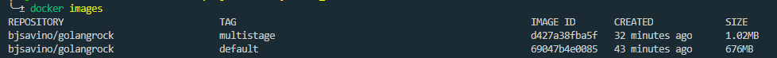

# FullCycle - Desafio Docker GoLang

Este projeto tem como objetivo exercitar a geração multistage de imagems docker.
Foi desenvolvido um programa no estiloHello World que exibe a mensagem <strong>Code.education Rocks!</strong> quando executado.

## Resultado

<p align="center">
    
</p>

No comparativo de tamanho das imagens, a imagem gerada com a imagem padrão do golang resulta em 676MB enquanto que a versão construida em multistage ficou em 1.02MB.

## Execução

Para rodar o container na sua máquina, basta executar:

```
docker run --rm bjsavino/golangrock:multistage 
```

